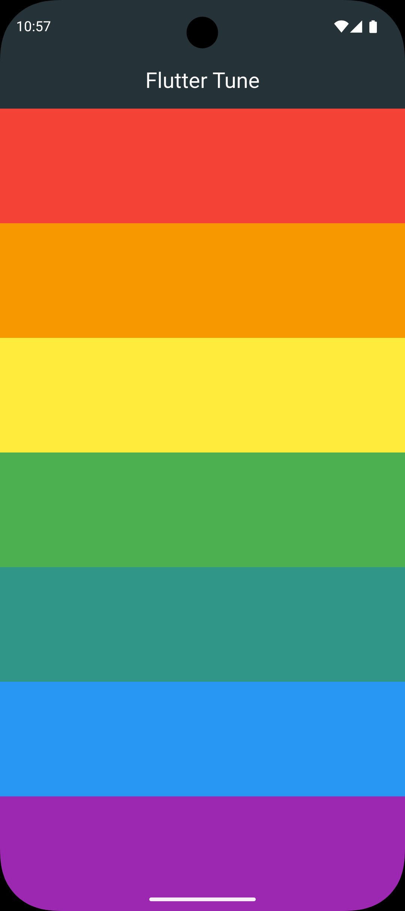

# 🎵 Tunes Player App

A colorful musical instrument Flutter application that lets you play different musical notes.

## Features

- 🎹 **7 Musical Notes** - Each with a unique color and sound
- 🎨 **Beautiful UI** - Colorful interface with distinct colors for each note
- 🔊 **Audio Playback** - Uses `audioplayers` package for sound playback
- 📱 **Cross-Platform** - Works on Android, iOS, Web, Windows, Linux, and macOS

## Screenshots

<div align="center">
  
</div>

## Tech Stack

- **Framework**: Flutter
- **Language**: Dart
- **Audio Package**: [audioplayers](https://pub.dev/packages/audioplayers) v5.2.1

## Project Structure

```
lib/
├── main.dart           # App entry point
├── models/
│   └── tune_model.dart # Data model for musical notes
├── views/
│   └── tune_view.dart  # Main screen with all notes
└── widgets/
    └── tune_item.dart  # Individual note widget
```

## Getting Started

### Prerequisites

- Flutter SDK (>=3.5.4)
- Dart SDK
- An IDE (Android Studio, VS Code, etc.)

### Installation

1. Clone the repository:
```bash
git clone <repository-url>
cd tunes_player_app
```

2. Install dependencies:
```bash
flutter pub get
```

3. Run the app:
```bash
flutter run
```

## How to Use

- Tap on any colored bar to play its corresponding musical note
- Each of the 7 notes has a unique color and sound
- Enjoy making music!

## Assets

The app includes 7 audio files located in the `assets/` directory:
- `note1.wav` through `note7.wav`

## Building for Production

### Android
```bash
flutter build apk --release
```

### iOS
```bash
flutter build ios --release
```

### Web
```bash
flutter build web --release
```

### Desktop (Windows/Linux/macOS)
```bash
flutter build windows --release
flutter build linux --release
flutter build macos --release
```

## Dependencies

- `cupertino_icons`: ^1.0.8 - iOS style icons
- `audioplayers`: ^5.2.1 - Audio playback functionality

## Development

To enable hot reload during development:
```bash
flutter run --hot
```

## Contributing

Contributions are welcome! Feel free to submit pull requests or open issues for bugs and feature requests.

## License

This project is open source and available for learning and development purposes.

## Acknowledgments

- Built with [Flutter](https://flutter.dev/)
- Audio package by [audioplayers](https://pub.dev/packages/audioplayers)

---


